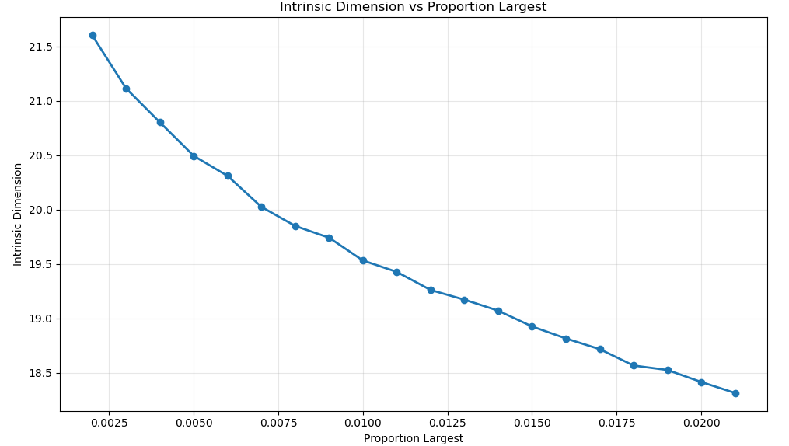

# Estimating the Intrinsic Dimension of Human Knowledge

### Background and Motivation

The Dewey Decimal System, still used in most libraries, maps human knowledge into a single numerical dimension. But it is easy to find books on complex or interdisciplinary topics that could logically map to multiple distinct numbers on that single dimension. Ideally, human knowledge would be indexed with a finite set of numbers that would optimally locate each chunk of knowledge in proximity to related information. But what is the minimum size of that set of numbers? Using mathematical terminology, the answer to this question is called the intrinsic dimension of all human knowledge.

Modern large language models (LLM’s) use sets of thousands to tens of thousands of floating-point numbers to encode human knowledge in their scope of understanding. Data scientists call these “vector embeddings”. But when a human being is thinking, he or she is mapping thought into the three-dimensional space of the human brain. This strongly suggests that the intrinsic dimension of human knowledge is much lower than thousands. There would seem to be a lot of room for improvement in modern LLM’s!

I have pondered the intrinsic dimension of human knowledge for decades. Algorithms to measure intrinsic dimension of large sets of high-dimensional vectors have been available for quite a while. But high-dimensional vectors to represent a large sample of human knowledge have not – until now! The vector embeddings of LLM’s provide just that.

### Method and Results

About 1-2 years ago, Qdrant published 768-dimensional vector embeddings generated from 2,254,000 scientific abstracts from the ArXiv repository using the InstructorXL embedding model (https://huggingface.co/datasets/Qdrant/arxiv-abstracts-instructorxl-embeddings). I take these to be a substantial sample of all human knowledge. Then I used the scikit-dimension Python package from https://github.com/scikit-learn-contrib/scikit-dimension to measure the intrinsic dimension of this set of vectors by a method called correlation dimension (https://en.wikipedia.org/wiki/Correlation_dimension). The plot below gives the results for a full range of distances between vector embeddings from median distance to 1-2% of a random sample set to median distance to 98-99% of the random sample set.

I also "zoomed in" to short range below 2% of the random sample set:

 
 To see if the remarkably smooth results of this experiment were related to the specific dataset or embedding model, I ran the same analysis with a dataset of 35 million+ vector embeddings of paragraphs in English Wikipedia generated by Cohere in 2022 using their own Cohere multilingual-22-12 embedding model: https://huggingface.co/datasets/Cohere/wikipedia-22-12-en-embeddings?ref=cohere-ai.ghost.io. These are the remarkably similar results:
 
 
 
 

### Interpretation and Implications

Considering that the roll-off above ~80% of the random sample sets is very likely due to outer boundary effects, we draw the conclusion that human knowledge has intrinsic dimension in a range of about 22 to 4 -- ~22 for very closely related knowledge and ~4 for knowledge that might seem to have little meaningful relationship. And the transition between the two extremes is a smooth characteristic curve suggesting that a universal mathematical model for the geometrical structure of human knowledge is possible.

Assuming that this pattern of intrinsic dimension is found in many other relevant datasets, the implications of this discovery are profound. The efficiency and speed of modern AI might be improved by one or two orders of magnitude. Scientific knowledge might be explored for gaps or new creative associations previously indiscernible. If human knowledge is inherently low-dimensional with a universal geometrical structure, what might this tell us about the nature of human intelligence and even physical reality? I invite all capable researchers to grab this code and explore!

### Computational Requirements

I ran these experiments on a robust MSI Summit A16 AI+ A3HM Windows 11 laptop with 32 GB of RAM and a 1 TB SSD. I was able to use 20-30 K random samples from which the method of correlation dimension calcultaes a distance matrix. If you use too many samples, you can easily cause your Python engine to crash. 

### Acknowledgement

I offer my heartfelt thanks and compliments to the Anthropic team for the very impressive Claude Sonnet 4, which did almost all of my code and helped in brainstorming, and to Jonathan Bac et al for recognizing the value of exploring intrinsic dimension and making the scikit-dimension package to enable that exploration. 
